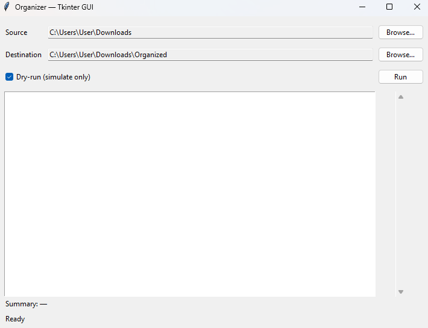

# Automatic File Organizer

A simple **Python** tool to organize files by extension, moving them into categorized subfolders.  
Perfect for keeping folders like `Downloads` clean and tidy automatically.

## Screenshot

Here’s how the Tkinter GUI looks:



## ✨ Features (MVP)
- **Fixed mapping** of extensions → categories (Documents, Images, Audio, etc.)
- **Dry-run** (`--dry-run`): simulates the process without moving any files
- Safe move: prevents overwriting existing files (`-1`, `-2`…)
- Automatically creates destination folders

---

## 📦 Requirements
- Python **3.10+**
- No external dependencies (uses only Python's standard library)

---

## 🔧 Installation

Create and activate a virtual environment:
```bash
python -m venv .venv
# Windows
.\.venv\Scripts\activate
# macOS/Linux
source .venv/bin/activate

Clone this repository:
git clone https://github.com/mircothibes/file-organizer.git
cd file-organizer

---

🚀 Usage
Simulation mode (dry-run)
python -m organizer.cli --src ~/Downloads --dst ~/Downloads/Organized --dry-run

Real execution
python -m organizer.cli --src ~/Downloads --dst ~/Downloads/Organized

---

Options
| Flag        | Description                                   | Default                 |
| ----------- | --------------------------------------------- | ----------------------- |
| `--src`     | Source folder                                 | `~/Downloads`           |
| `--dst`     | Destination folder                            | `~/Downloads/Organized` |
| `--dry-run` | Simulate the process without moving any files | `False`                 |


📂 Categories and Extensions
| Category   | Extensions                                                             |
| ---------- | ---------------------------------------------------------------------- |
| Documents  | `.pdf`, `.docx`, `.xlsx`, `.pptx`, `.txt`, `.md`                       |
| Images     | `.jpg`, `.jpeg`, `.png`, `.gif`, `.bmp`, `.webp`, `.svg`               |
| Audio      | `.mp3`, `.wav`, `.flac`, `.m4a`                                        |
| Videos     | `.mp4`, `.mov`, `.mkv`, `.avi`                                         |
| Archives   | `.zip`, `.rar`, `.7z`, `.tar`, `.gz`                                   |
| Installers | `.exe`, `.msi`, `.dmg`, `.pkg`                                         |
| Code       | `.py`, `.js`, `.ts`, `.html`, `.css`, `.json`, `.yaml`, `.yml`, `.xml` |
| Others     | Any extension not mapped above                                         |

---

📜 License
Distributed under the MIT License. See LICENSE for more information.

---

## 👨‍💻 Author

Developed by Marcos Vinicius Thibes Kemer

---